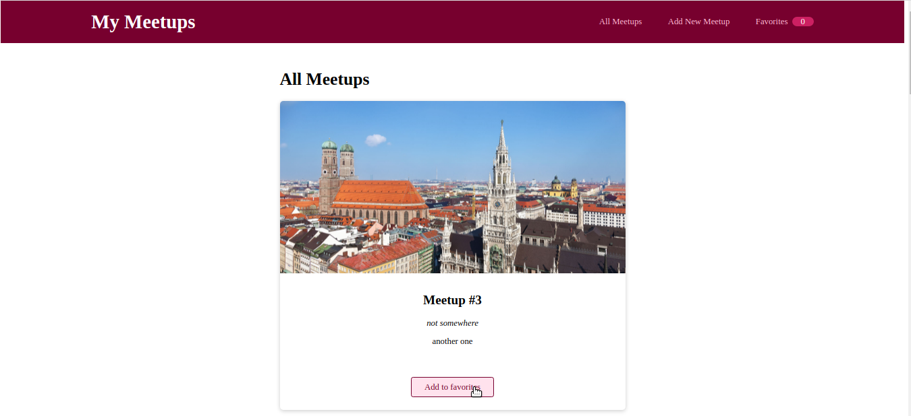
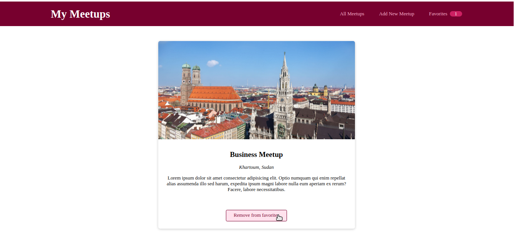
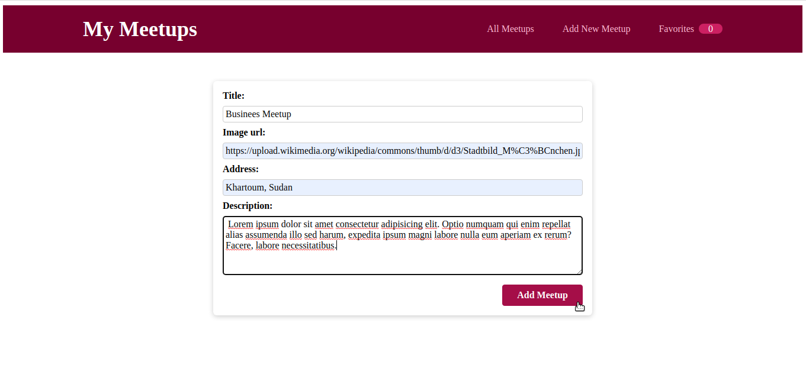

# React JS + Firebase Meetup App

**Based on Maximilian Schwarzmuller Tutorial on Youtube.**

## Try it live:

[https://meetup-app-vgy.pages.dev/](https://meetup-app-vgy.pages.dev/)

## What is learned:

1. React Routing.
2. Managing context globally.
3. More Advanced hooks (UseNavigate,useEffect,useContext).
4. Use forms with React.
5. Make requests to a server with React.
6. Create wrapping components (Card component).

## Screenshots:

